# 📜 Vietnamese Legal Document — Auto-Crawl, Parse & Status Update Pipeline

> **Project**: Multimodal Retrieval-Augmented Generation for Vietnamese Legal Documents
> **Last Updated**: 2026-02-08
> **Pipeline Version**: 2.0 (with Weekly Discovery)
> **Status**: Enrichment pipeline running (Tax/Fee/Levy), Discovery pipeline operational

---

## Table of Contents

1. [System Overview](#1-system-overview)
2. [Architecture Diagram](#2-architecture-diagram)
3. [Data Source & Dataset](#3-data-source--dataset)
4. [Module A — Document ID Matcher (`VBPLSearcher`)](#4-module-a--document-id-matcher-vbplsearcher)
5. [Module B — Status & History Scraper (`VBPLStatusScraper`)](#5-module-b--status--history-scraper-vbplstatusscraper)
6. [Module C — Gap-Fill Crawler (`VBPLCrawler`)](#6-module-c--gap-fill-crawler-vbplcrawler)
7. [Data Models & Traceability](#7-data-models--traceability)
8. [Parser Module — Structural Parsing](#8-parser-module--structural-parsing)
9. [Batch Enrichment Pipeline (`run_tax_enrichment.py`)](#9-batch-enrichment-pipeline-run_tax_enrichmentpy)
10. [New Document Discovery Pipeline (`discover_new_documents.py`)](#10-new-document-discovery-pipeline-discover_new_documentspy)
11. [Rate Limiting & Anti-Block Strategy](#11-rate-limiting--anti-block-strategy)
12. [Output Format, Checkpoints & Resume](#12-output-format-checkpoints--resume)
13. [File Reference & Dependencies](#13-file-reference--dependencies)
14. [Demo Results](#14-demo-results)
15. [Future Work & RAG Integration](#15-future-work--rag-integration)

---

## 1. System Overview

### Problem Statement

Our RAG system uses legal documents crawled from **thuvienphapluat.vn (TVPL)** — a VIP-subscription site. Three critical problems:

| # | Problem | Impact |
|---|---------|--------|
| 1 | **Outdated dataset** | Documents issued after the crawl date are missing entirely |
| 2 | **VIP paywall** | TVPL requires paid subscription; vbpl.vn (Chính phủ) is free and authoritative |
| 3 | **No validity tracking** | No way to know if a document is still valid, expired, partially amended, or replaced |

### Solution: Dual Pipeline Architecture

We built **two automated pipelines**:

| Pipeline | Script | Purpose | Input |
|----------|--------|---------|-------|
| **Pipeline 1: Enrichment** | `run_tax_enrichment.py` | Enrich **existing** documents in the dataset with validity + history | `data_universal/` (TVPL dataset) |
| **Pipeline 2: Discovery** | `discover_new_documents.py` | Find and fully process **new** documents not in the dataset | Date range on vbpl.vn |

Both pipelines share the same 3-job crawler core + 4-parser parsing engine:

| Job | Module | Role |
|-----|--------|------|
| **Job A** | `VBPLSearcher` | Map `so_hieu` → VBPL `ItemID` |
| **Job B** | `VBPLStatusScraper` | Scrape thuộc tính + lịch sử → validity/events |
| **Job C** | `VBPLCrawler` | Browse by date range + crawl toàn văn (HTML/PDF) |

---

## 2. Architecture Diagram

### Overall System Architecture

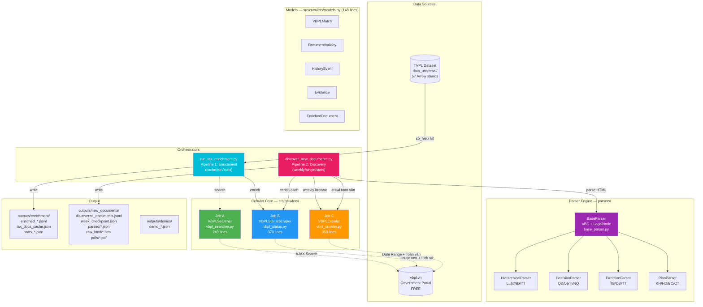

### Pipeline 1: Enrichment Flow (Existing Documents)

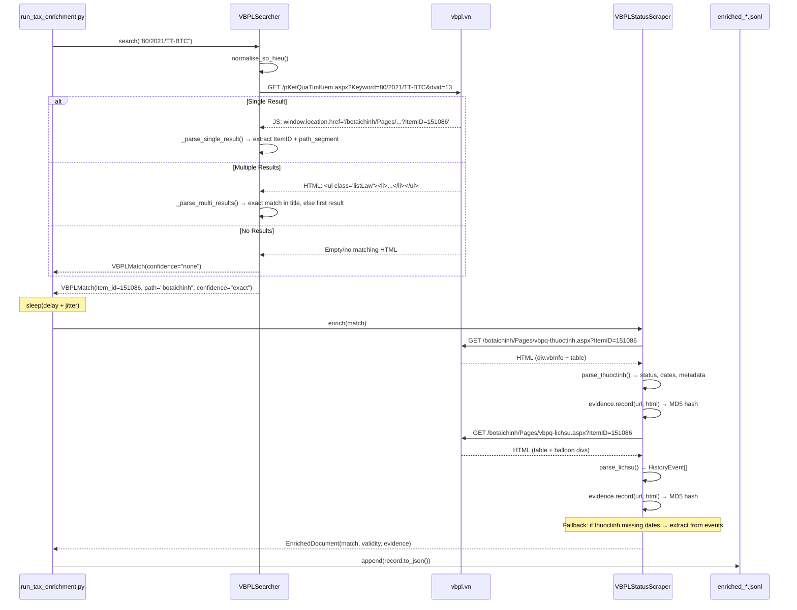

### Pipeline 2: Weekly Discovery Flow (New Documents)

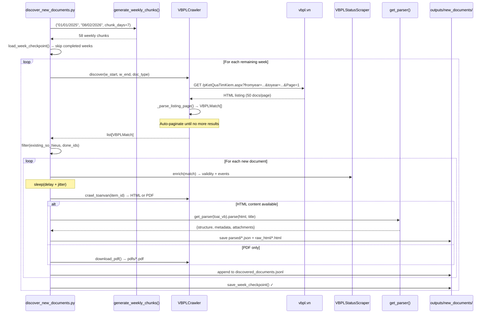

---

## 3. Data Source & Dataset

### TVPL Dataset (`data_universal/`)

| Property | Value |
|----------|-------|
| **Format** | HuggingFace Datasets (Apache Arrow) |
| **Split** | `train` (single split) |
| **Shards** | 57 files (`data-00000-of-00057.arrow` → `data-00056-of-00057.arrow`) |
| **Total rows** | ~150,000+ documents |
| **Storage** | External NTFS drive (slow sequential I/O — loading takes minutes) |
| **State file** | `data_universal/dataset_dict.json` |

#### Key Columns

| Column | Type | Description | Example |
|--------|------|-------------|---------|
| `so_hieu` | `str` | Document number (unique ID) | `"80/2021/TT-BTC"` |
| `title` | `str` | Full document title | `"Thông tư hướng dẫn thi hành..."` |
| `loai_van_ban` | `str` | Document type | `"Thông tư"`, `"Luật"`, `"Nghị định"` |
| `category` | `str` | Subject category | `"Thue-Phi-Le-Phi"` |
| `tinh_trang` | `str` | Status (from TVPL, often outdated) | `"Còn hiệu lực"` |
| `ngay_ban_hanh` | `str` | Issuance date | `"09/10/2021"` |
| `link` | `str` | Original TVPL link | `"https://thuvienphapluat.vn/..."` |
| `content_html` | `str` | Full HTML text body | `"<div>...</div>"` |

#### Tax/Fee/Levy Subset (Current Batch)

Filtered by: `category == "Thue-Phi-Le-Phi"` AND `loai_van_ban ∈ CENTRAL_TYPES`

| Document Type | Count | Description |
|---------------|-------|-------------|
| **Thông tư (TT)** | 602 | Circulars — most granular tax rules |
| **Nghị định (NĐ)** | 84 | Government decrees |
| **Thông tư liên tịch (TTLT)** | 56 | Joint circulars |
| **Luật** | 16 | Laws passed by National Assembly |
| **Pháp lệnh (PL)** | 9 | Ordinances by Standing Committee |
| **Total** | **767** | Unique central-level documents |

```python
# CENTRAL_TYPES filter (in run_tax_enrichment.py)
CENTRAL_TYPES = {"Luật", "Nghị định", "Thông tư", "Thông tư liên tịch", "Pháp lệnh"}
```

### vbpl.vn (Target Source)

| Property | Value |
|----------|-------|
| **Full name** | Cơ sở dữ liệu quốc gia về văn bản pháp luật |
| **URL** | `https://vbpl.vn` |
| **Authority** | Vietnamese Government (Bộ Tư pháp) |
| **Cost** | **Free** (public access) |
| **Content** | Full text (HTML for older docs, PDF for newer docs) |
| **Key pages per doc** | `vbpq-thuoctinh.aspx` (attributes), `vbpq-lichsu.aspx` (history), `vbpq-toanvan.aspx` (full text) |
| **AJAX endpoint** | `/VBQPPL_UserControls/Publishing/TimKiem/pKetQuaTimKiem.aspx` |
| **PDF AJAX endpoint** | `/VBQPPL_UserControls/Publishing_22/pViewVBGoc.aspx` |

---

## 4. Module A — Document ID Matcher (`VBPLSearcher`)

> **File**: `src/crawlers/vbpl_searcher.py` (249 lines)
> **Class**: `VBPLSearcher`
> **Purpose**: Map `so_hieu` from TVPL dataset → VBPL internal `ItemID`
> **Used by**: Pipeline 1 (enrichment) and Pipeline 2 (single-document mode)

### AJAX Search Endpoint

```
GET https://vbpl.vn/VBQPPL_UserControls/Publishing/TimKiem/pKetQuaTimKiem.aspx
```

#### Query Parameters

| Parameter | Value | Description |
|-----------|-------|-------------|
| `dvid` | `13` | Database division ID (13 = Trung ương / Central) |
| `IsVietNamese` | `True` | Language flag |
| `type` | `0` | Search type (0 = default) |
| `s` | `1` | Sort order |
| `Keyword` | `{so_hieu}` | The document number to search for |
| `SearchIn` | `Title,Title1` | Search in both title fields |
| `IsRec` | `1` | Include recursive results |
| `pv` | `0` | Page view mode |

#### Two Response Modes

The AJAX endpoint returns **two different formats** depending on result count:

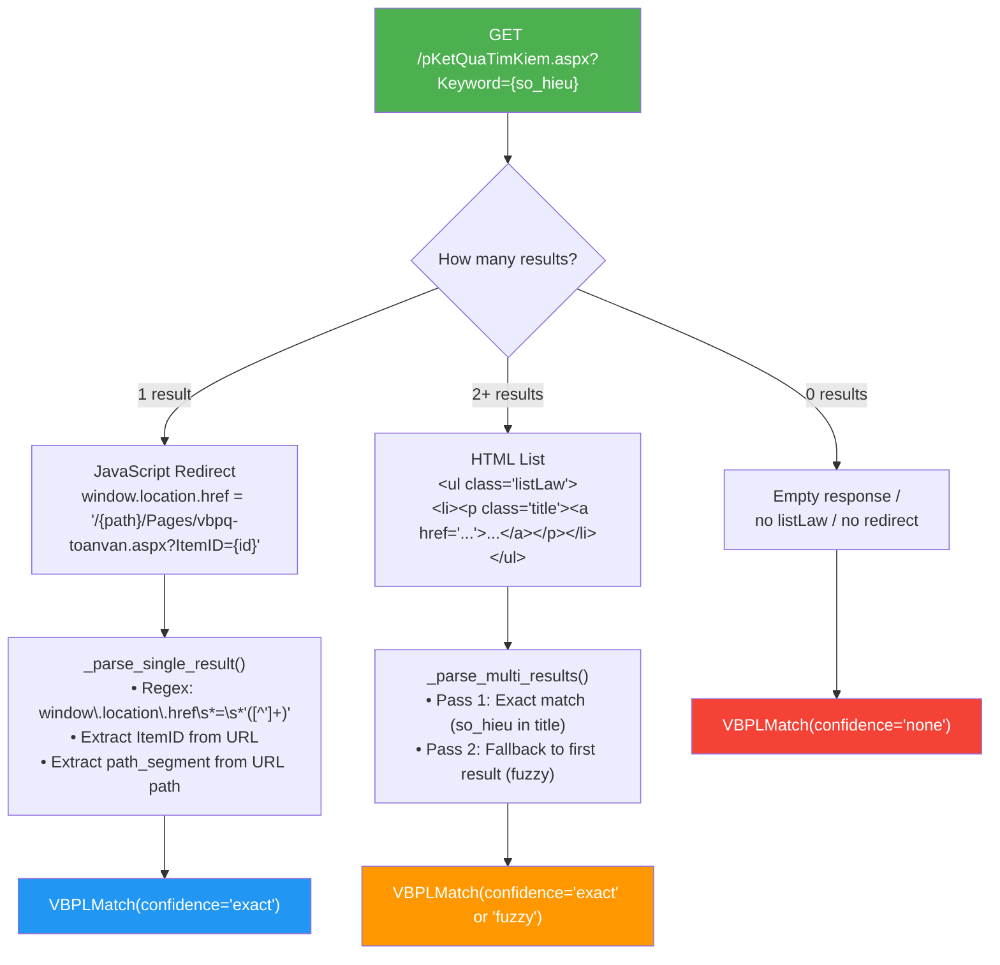

### `dvid` — Database Division ID

**Critical discovery**: `dvid` is NOT hardcoded to 13. It's dynamically extracted from the redirect URL's path segment:

```python
@staticmethod
def _extract_path_segment(url: str) -> str:
    """'/botaichinh/Pages/...' → 'botaichinh'"""
    url = url.strip("/")
    parts = url.split("/")
    if len(parts) >= 2 and parts[1].lower() == "pages":
        return parts[0]
    return parts[0] if parts else "TW"
```

| Path Segment | dvid | Meaning |
|--------------|------|---------|
| `TW` / `tw` | 13 | Trung ương (Central Government) |
| `botaichinh` | 14 | Bộ Tài chính (Ministry of Finance) |
| `boquocphong` | 16 | Bộ Quốc phòng (Ministry of Defence) |
| *others* | extracted at runtime | Provincial/ministerial divisions |

The `path_segment` is stored in `VBPLMatch` and used for all subsequent page requests (thuộc tính, lịch sử, toàn văn).

### `so_hieu` Normalisation

```python
@staticmethod
def normalise_so_hieu(so_hieu: str) -> str:
    # 1. NFC Unicode normalisation
    s = unicodedata.normalize("NFC", so_hieu.strip())
    # 2. Normalise all dash variants → ASCII hyphen
    #    Covers: – (en-dash), — (em-dash), ‐ ‑ ‒ ― ⁻ ₋ − ﹘ ﹣ ー
    s = re.sub(r"[\u2010-\u2015\u2212\uFE58\uFE63\uFF0D]", "-", s)
    # 3. Collapse whitespace
    s = re.sub(r"\s+", " ", s)
    return s
```

### Multi-Result Matching Strategy

`_parse_multi_results()` uses a two-pass approach:

```python
# Pass 1: Exact match — normalised so_hieu found inside title text
for item in items:
    title_norm = normalise(title_text).lower()
    if normalised in title_norm or normalised.replace(" ", "") in title_norm.replace(" ", ""):
        return VBPLMatch(confidence="exact")

# Pass 2: Fallback — take first result with lower confidence
first = items[0]
return VBPLMatch(confidence="fuzzy")
```

### Class API: `VBPLSearcher`

| Attribute | Type | Default | Description |
|-----------|------|---------|-------------|
| `session` | `requests.Session` | auto | Persistent HTTP session with User-Agent |
| `delay` | `float` | `1.0` | Minimum seconds between requests |
| `_last_request_time` | `float` | `0` | Timestamp of last request |

| Method | Signature | Return | Description |
|--------|-----------|--------|-------------|
| `search` | `(so_hieu: str)` | `VBPLMatch` | Main entry. Search VBPL for a document |
| `normalise_so_hieu` | `(s: str)` | `str` | Static. Normalise Unicode + dashes |
| `_build_search_url` | `(keyword, dvid)` | `str` | Build AJAX URL with params |
| `_parse_single_result` | `(html, so_hieu, url)` | `Optional[VBPLMatch]` | Parse JS redirect response |
| `_parse_multi_results` | `(html, so_hieu, url)` | `Optional[VBPLMatch]` | Parse HTML list response |
| `_extract_path_segment` | `(url)` | `str` | Static. Extract path seg from URL |
| `_rate_limit` | `()` | `None` | Enforce delay between requests |

### Regex Patterns

| Name | Pattern | Purpose |
|------|---------|---------|
| `RE_REDIRECT` | `r"window\.location\.href\s*=\s*'([^']+)'"` | Extract redirect URL from JS |
| `RE_ITEM_ID` | `r"ItemID=(\d+)"` | Extract ItemID from any URL |

### HTTP Configuration

```python
HEADERS = {
    "User-Agent": "Mozilla/5.0 (X11; Linux x86_64) AppleWebKit/537.36 "
                  "(KHTML, like Gecko) Chrome/120.0.0.0 Safari/537.36",
}
# Timeout: 30 seconds per request
# Session: requests.Session() — persistent TCP + cookies
```

---

## 5. Module B — Status & History Scraper (`VBPLStatusScraper`)

> **File**: `src/crawlers/vbpl_status.py` (370 lines)
> **Class**: `VBPLStatusScraper`
> **Purpose**: Fetch Thuộc tính (attributes) + Lịch sử (history) for a known ItemID → produce `EnrichedDocument`
> **Used by**: Both Pipeline 1 and Pipeline 2

### Pages Scraped

For each matched document, two pages are fetched:

| Page | URL Pattern | Content |
|------|-------------|---------|
| **Thuộc tính** | `/{path_segment}/Pages/vbpq-thuoctinh.aspx?ItemID={id}` | Status, dates, issuing authority, signer, scope |
| **Lịch sử** | `/{path_segment}/Pages/vbpq-lichsu.aspx?ItemID={id}` | Complete amendment/replacement history timeline |

### Thuộc tính Page Structure

```
┌─────────────────────────────────────────────────┐
│ div.vbInfo (Header)                             │
│   Hiệu lực: [Còn hiệu lực / Hết hiệu lực]    │
│   Ngày có hiệu lực: dd/mm/yyyy                 │
│   [Ngày hết hiệu lực: dd/mm/yyyy]  (optional)  │
├─────────────────────────────────────────────────┤
│ <table> (Attributes)                            │
│   Row: Số ký hiệu      | VALUE | Ngày BH | VAL │
│   Row: Loại văn bản     | VALUE | Ngày HL | VAL │
│   Row: Nguồn thu thập   | VALUE | Ngày CB | VAL │
│   Row: Ngành            | VALUE | Lĩnh vực| VAL │
│   Row: CQ ban hành      | VALUE | Chức danh| VAL│
│   Row: Phạm vi          | VALUE                 │
│   Row: Tình trạng hiệu lực: VALUE              │
└─────────────────────────────────────────────────┘
```

#### Header Parser (`_parse_thuoctinh_header`)

Extracts from `div.vbInfo` using `get_text(separator="|")` then splitting on `|`:

```python
text = vbinfo.get_text(separator="|", strip=True)
parts = [p.strip() for p in text.split("|") if p.strip()]
# Scans parts for: "Hiệu lực:" → next = status_raw
#                   "Ngày có hiệu lực" → next = effective_date
#                   "Ngày hết hiệu lực" → next = expiry_date
```

| Field | Source Pattern | Output Key |
|-------|----------------|------------|
| Status | `"Hiệu lực:"` → next part | `status_raw` |
| Effective Date | `"Ngày có hiệu lực"` → next part | `effective_date` |
| Expiry Date | `"Ngày hết hiệu lực"` → next part | `expiry_date` |

#### Table Parser (`_parse_thuoctinh_table`)

Iterates `<tr>` rows, maps cell labels to dictionary keys using `FIELD_MAP`:

```python
FIELD_MAP = {
    "Số ký hiệu":           "so_ky_hieu",
    "Ngày ban hành":         "ngay_ban_hanh",
    "Loại văn bản":          "loai_van_ban",
    "Ngày có hiệu lực":     "ngay_co_hieu_luc",
    "Ngành":                 "nganh",
    "Lĩnh vực":              "linh_vuc",
    "Phạm vi":               "pham_vi",
    "Tình trạng hiệu lực":  "tinh_trang",
}
```

Special handling for the compound row "Cơ quan ban hành/ Chức danh / Người ký":

```python
if "Cơ quan ban hành" in cell_text:
    result["co_quan_ban_hanh"] = cells[i + 1].get_text(strip=True)
    result["chuc_danh"]        = cells[i + 2].get_text(strip=True)
    result["nguoi_ky"]         = cells[i + 3].get_text(strip=True)
```

| Label Text | Dict Key | Example Value |
|------------|----------|---------------|
| `Số ký hiệu` | `so_ky_hieu` | `"80/2021/TT-BTC"` |
| `Ngày ban hành` | `ngay_ban_hanh` | `"09/10/2021"` |
| `Loại văn bản` | `loai_van_ban` | `"Thông tư"` |
| `Ngành` | `nganh` | `"Tài chính - Ngân hàng"` |
| `Lĩnh vực` | `linh_vuc` | `"Thuế - Phí - Lệ Phí"` |
| `Cơ quan ban hành` | `co_quan_ban_hanh` | `"Bộ Tài chính"` |
| `Chức danh` | `chuc_danh` | `"Thứ trưởng"` |
| `Người ký` | `nguoi_ky` | `"Cao Anh Tuấn"` |
| `Phạm vi` | `pham_vi` | `"Toàn quốc"` |
| `Tình trạng hiệu lực` | `tinh_trang` | `"Còn hiệu lực"` |

### Lịch sử Page Structure

```
┌──────────────────────────────────────────────────────────────┐
│ <table>                                                      │
│   Row 0: Caption "Lịch sử hiệu lực: {title}"               │
│   Row 1: Header "Ngày | Trạng thái | VB nguồn | Phần HHL"  │
│   Row 2: 01/07/2008 | Văn bản có hiệu lực | 13/2008/QH12   │
│   Row 3: 30/05/2014 | Bị sửa đổi 1 phần   | 71/2014/QH13   │
│   ...                                                        │
├──────────────────────────────────────────────────────────────┤
│ Balloon Divs (hidden, linked by "Xem tại đây")              │
│   <div class="balloonstyle" id="balloon_40742_9">            │
│     Điểm c khoản 2 Điều 8; Khoản 1 Điều 3; ...             │
│   </div>                                                     │
└──────────────────────────────────────────────────────────────┘
```

#### History Parser (`parse_lichsu`)

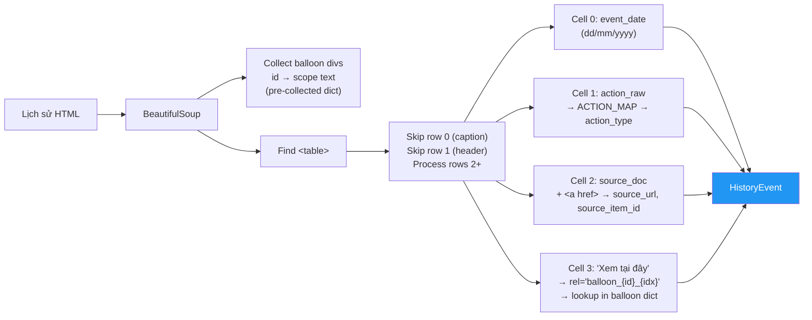

#### Column 2 (source_doc) Parsing Detail

```python
source_a = source_cell.find("a", href=True)
if source_a:
    href = source_a.get("href", "")
    if href and "javascript" not in href:
        source_url = f"https://vbpl.vn{href}" if href.startswith("/") else href
        id_match = self.RE_ITEM_ID.search(href)
        if id_match:
            source_item_id = int(id_match.group(1))
```

#### Column 3 (balloon scope text) Parsing Detail

```python
# Balloon link: <a href="javascript:;" rel="balloon_40742_9">Xem tại đây</a>
detail_a = detail_cell.find("a", rel=True)
if detail_a:
    balloon_id = detail_a.get("rel", [""])[0]  # rel can be list in BS4
    scope_text = balloons.get(balloon_id, "")   # lookup pre-collected dict
else:
    # Sometimes text is directly in the cell
    scope_text = detail_cell.get_text(strip=True)
    if scope_text == "Xem tại đây":
        scope_text = ""  # Link without balloon content
```

### Balloon Scope Text — The Secret Sauce

When a document is **partially** amended/abolished, vbpl.vn stores the exact scope (which Điều/Khoản/Điểm are affected) in hidden `div.balloonstyle` elements:

```html
<!-- Hidden balloon div (separate from the table) -->
<div class="balloonstyle" id="balloon_40742_9">
  Điểm c khoản 2 Điều 8; Khoản 1 Điều 3; Phụ lục 1
</div>

<!-- In the history table, column 4 -->
<td><a href="javascript:;" rel="balloon_40742_9">Xem tại đây</a></td>
```

Our extraction algorithm:
1. Pre-collect all `div.balloonstyle` into `{id: text}` dict (before processing the table)
2. For each history row, read the `<a rel="balloon_xxx">` attribute
3. Lookup `scope_text = balloons[balloon_id]`

This gives us **article-level granularity** on what changed — essential for the FRBR Check in the RAG guardrail.

### Status Normalisation Maps

#### `STATUS_MAP` (7 entries) — Validity Status

| Vietnamese (raw) | English (normalised) | Meaning |
|-------------------|---------------------|---------|
| `Còn hiệu lực` | `valid` | Currently in effect |
| `Hết hiệu lực toàn bộ` | `expired` | Fully expired |
| `Hết hiệu lực một phần` | `partial` | Partially expired / amended |
| `Hết hiệu lực` | `expired` | Expired (short form) |
| `Chưa có hiệu lực` | `not_yet_effective` | Not yet in effect |
| `Ngưng hiệu lực` | `suspended` | Suspended |
| `Ngưng hiệu lực một phần` | `partial_suspended` | Partially suspended |

#### `ACTION_MAP` (12 entries) — History Event Types

| Vietnamese Action | Normalised Type | Description |
|-------------------|-----------------|-------------|
| `Văn bản được ban hành` | `issued` | Document was issued |
| `Văn bản có hiệu lực` | `effective` | Came into effect |
| `Văn bản hết hiệu lực` | `expired` | Expired naturally |
| `Bị hết hiệu lực` | `expired_by` | Expired by another doc |
| `Bị thay thế` / `Bị thay thế bởi` | `replaced` | Replaced by another doc |
| `Bị bãi bỏ` | `abolished` | Abolished entirely |
| `Bị bãi bỏ 1 phần` | `partial_abolish` | Partially abolished |
| `Bị sửa đổi 1 phần` | `partial_amend` | Partially amended |
| `Được bổ sung` | `supplemented` | Supplemented |
| `Được sửa đổi` / `Sửa đổi, bổ sung` | `amended` | Amended |

### Fallback Logic in `enrich()`

If the Thuộc tính page doesn't provide complete information, the scraper infers from Lịch sử events:

```python
# Fallback 1: Missing effective_date → find first "effective" event
if not validity.effective_date:
    for ev in events:
        if ev.action_type == "effective":
            validity.effective_date = ev.event_date
            break

# Fallback 2: Missing expiry_date → find last "expired" event (reverse scan)
if not validity.expiry_date:
    for ev in reversed(events):
        if ev.action_type in ("expired", "expired_by"):
            validity.expiry_date = ev.event_date
            break

# Fallback 3: Status unknown → infer from last event
if validity.status_current == "unknown" and events:
    last = events[-1]
    if last.action_type in ("expired", "expired_by"):
        validity.status_current = "expired"
    elif last.action_type == "effective":
        validity.status_current = "valid"
    elif last.action_type in ("partial_abolish", "partial_amend"):
        validity.status_current = "partial"
```

### Additional Logic in `enrich()`

```python
# Auto-fill match title if missing
if not match.matched_title and validity.so_ky_hieu:
    match.matched_title = validity.so_ky_hieu
```

### Class API: `VBPLStatusScraper`

| Attribute | Type | Default | Description |
|-----------|------|---------|-------------|
| `session` | `requests.Session` | auto | Persistent HTTP session |
| `delay` | `float` | `1.0` | Minimum seconds between requests |
| `_last_request_time` | `float` | `0` | Timestamp of last request |

| Method | Signature | Return | Description |
|--------|-----------|--------|-------------|
| `enrich` | `(match: VBPLMatch)` | `EnrichedDocument` | Main entry. Fetch thuoctinh + lichsu |
| `parse_thuoctinh` | `(html: str)` | `dict` | Parse attributes page (header + table) |
| `parse_lichsu` | `(html: str)` | `list[HistoryEvent]` | Parse history page (table + balloons) |
| `_parse_thuoctinh_header` | `(soup)` | `dict` | Static. Extract `div.vbInfo` block |
| `_parse_thuoctinh_table` | `(soup)` | `dict` | Static. Extract attributes table |
| `_fetch` | `(url: str)` | `str` | Fetch with rate limiting + timeout |
| `_rate_limit` | `()` | `None` | Enforce delay |

---

## 6. Module C — Gap-Fill Crawler (`VBPLCrawler`)

> **File**: `src/crawlers/vbpl_crawler.py` (358 lines)
> **Class**: `VBPLCrawler`
> **Purpose**: (1) Discover new documents by date range, (2) Crawl toàn văn (HTML/PDF)
> **Used by**: Pipeline 2 (discovery), also by Pipeline 2 single-doc mode for toàn văn

### Discovery — Browse by Date Range

Uses the same AJAX endpoint as the searcher, but with **date filters** and **empty keyword**:

```
GET /pKetQuaTimKiem.aspx
  ?dvid=13&IsVietNamese=True&type=0&s=1
  &Keyword=&SearchIn=Title,Title1&IsRec=1&pv=0
  &fromyear={dd/mm/yyyy}&toyear={dd/mm/yyyy}
  [&idLoaiVanBan={type_id}]
  &Page={n}&RowPerPage=50
```

#### Additional Parameters (vs. Searcher)

| Parameter | Value | Description |
|-----------|-------|-------------|
| `Keyword` | `""` (empty) | No keyword filter — browse all docs in range |
| `fromyear` | `dd/mm/yyyy` | Start date (Vietnamese date format) |
| `toyear` | `dd/mm/yyyy` | End date |
| `Page` | `1, 2, 3...` | Pagination (auto-incremented) |
| `RowPerPage` | `50` | Results per page (VBPL maximum) |
| `idLoaiVanBan` | `17, 20, 22...` | Optional doc type filter |

#### Document Type IDs (`LOAI_VAN_BAN_IDS`)

Defined as a constant dict (11 entries):

| Document Type | VBPL ID | Vietnamese Description |
|---------------|---------|----------------------|
| Hiến pháp | 15 | Constitution |
| Bộ luật | 16 | Code |
| Luật | 17 | Law |
| Nghị quyết | 18 | Resolution |
| Pháp lệnh | 19 | Ordinance |
| Nghị định | 20 | Decree |
| Quyết định | 21 | Decision |
| Thông tư | 22 | Circular |
| Thông tư liên tịch | 23 | Joint Circular |
| Lệnh | 2 | Order |
| Nghị quyết liên tịch | 3 | Joint Resolution |

### `discover()` Method — Auto-Pagination

```python
def discover(self, from_date, to_date, dvid=13, loai_van_ban=None, max_pages=100):
```

**Algorithm**:
1. Build URL with date range + optional type filter
2. Fetch page 1 → extract total count via regex `Tìm thấy\s*<b>(\d+)</b>`
3. Parse listing → `VBPLMatch[]` via `_parse_listing_page()`
4. Deduplicate using `seen_ids: set[int]`
5. Auto-paginate until empty page or `max_pages` reached

### Listing Page Parser (`_parse_listing_page`)

Handles both single-result (JS redirect) and multi-result (HTML list):

```python
# Single result: JS redirect
redirect_match = re.search(r"window\.location\.href\s*=\s*'([^']+)'", html)

# Multi result: HTML list items
items = soup.select("ul.listLaw li")
for item in items:
    title_a = item.select_one("p.title a")     # Title + href with ItemID
    info_ps = item.select("div.right p")        # Ban hành, Hiệu lực, Trạng thái

    # Extract so_hieu from title text
    so_hieu_match = re.search(r"(\d+/\d{4}/[A-ZĐa-zđ\-]+)", title_text)
```

For each `<li>`, extracts:

| Field | Source | Method |
|-------|--------|--------|
| `so_hieu` | Title text | Regex `r"(\d+/\d{4}/[A-ZĐa-zđ\-]+)"` |
| `vbpl_item_id` | `<a href="...?ItemID={id}">` | Regex `RE_ITEM_ID` |
| `path_segment` | URL path | Split on `/` |
| `matched_title` | `<p class="title">` text | `.text.strip()` |
| `ban_hanh` | `div.right p` | Text after `"Ban hành:"` |
| `hieu_luc` | `div.right p` | Text after `"Hiệu lực:"` |
| `trang_thai` | `div.right p` | Text after `"Trạng thái:"` |

### Full Text Retrieval (`crawl_toanvan`)

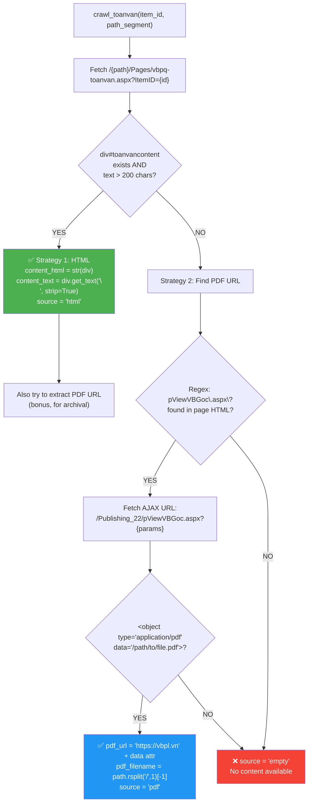

#### HTML vs PDF Availability (Observed Patterns)

| Document Type | Era | Content Source | Notes |
|---------------|-----|----------------|-------|
| Luật (older) | Before ~2019 | **HTML** (`div#toanvancontent`) | Server-rendered, parseable |
| Nghị định (older) | Before ~2019 | **HTML** | Same as above |
| Thông tư (older) | Before ~2020 | **HTML** | Same as above |
| Luật (newer) | ~2020+ | **PDF only** | Scanned/digital PDF |
| Nghị định (newer) | ~2021+ | **PDF only** | Same |
| Thông tư (newer) | ~2021+ | **PDF only** | Same |

#### 200-char Threshold

```python
if toanvan_div and len(toanvan_div.get_text(strip=True)) > 200:
    # Use HTML content
```

Some pages have an empty `div#toanvancontent` with boilerplate only (~50 chars). The 200-char threshold filters these out.

#### PDF URL Extraction (`_extract_pdf_url`)

```python
# Step 1: Find VBGoc AJAX reference in main page HTML
vbgoc_match = re.search(r'pViewVBGoc\.aspx\?([^"]+)', page_html)

# Step 2: Fetch the AJAX endpoint
ajax_url = f"https://vbpl.vn/VBQPPL_UserControls/Publishing_22/pViewVBGoc.aspx?{params}"

# Step 3: Parse response for embedded PDF object
obj_tag = soup.find("object", attrs={"type": "application/pdf"})
if obj_tag and obj_tag.get("data"):
    pdf_url = f"https://vbpl.vn{obj_tag['data']}"
    pdf_filename = obj_tag['data'].rsplit("/", 1)[-1]
```

### PDF Download (`download_pdf`)

```python
def download_pdf(self, pdf_url: str, save_path: str) -> str:
    resp = self.session.get(pdf_url, timeout=60, stream=True)
    resp.raise_for_status()
    os.makedirs(os.path.dirname(save_path), exist_ok=True)
    with open(save_path, "wb") as f:
        for chunk in resp.iter_content(chunk_size=8192):
            f.write(chunk)
```

### Return Schema from `crawl_toanvan()`

```python
{
    "page_url":      str,           # Full URL of the toàn văn page
    "content_html":  Optional[str], # Inner HTML of div#toanvancontent
    "content_text":  Optional[str], # Plain text (get_text with "\n" separator)
    "pdf_url":       Optional[str], # Direct link to PDF file on vbpl.vn
    "pdf_filename":  Optional[str], # Filename of the PDF
    "source":        str,           # "html" | "pdf" | "empty"
}
```

### Class API: `VBPLCrawler`

| Attribute | Type | Default | Description |
|-----------|------|---------|-------------|
| `session` | `requests.Session` | auto | Persistent HTTP session |
| `delay` | `float` | `1.5` | Minimum seconds between requests |
| `_last_request_time` | `float` | `0` | Timestamp of last request |

| Method | Signature | Return | Description |
|--------|-----------|--------|-------------|
| `discover` | `(from_date, to_date, dvid, loai_van_ban, max_pages)` | `list[VBPLMatch]` | Browse date range, collect all docs |
| `crawl_toanvan` | `(item_id: int, path_segment: str)` | `dict` | Fetch full text (HTML→PDF→empty) |
| `download_pdf` | `(pdf_url: str, save_path: str)` | `str` | Download PDF file to disk |
| `_build_browse_url` | `(from_date, to_date, page, rows, dvid, loai_id)` | `str` | Build paginated search URL |
| `_parse_listing_page` | `(html: str)` | `list[VBPLMatch]` | Parse one page of results |
| `_get_total_count` | `(html: str)` | `int` | Extract `Tìm thấy <b>N</b>` |
| `_extract_pdf_url` | `(page_html, result)` | `None` (mutates) | Find PDF URL via VBGoc AJAX |
| `_fetch` | `(url: str)` | `str` | Fetch with rate limiting |
| `_rate_limit` | `()` | `None` | Enforce delay |

### Regex Patterns

| Name | Pattern | Purpose |
|------|---------|---------|
| `RE_ITEM_ID` | `r"ItemID=(\d+)"` | Extract ItemID from URL |
| `RE_TOTAL` | `r"Tìm thấy\s*<b>(\d+)</b>"` | Extract total count from search results |

---

## 7. Data Models & Traceability

> **File**: `src/crawlers/models.py` (148 lines)
> **Design Principle**: Every enriched field links back to evidence (URL + timestamp + HTML hash)

### Data Model Hierarchy

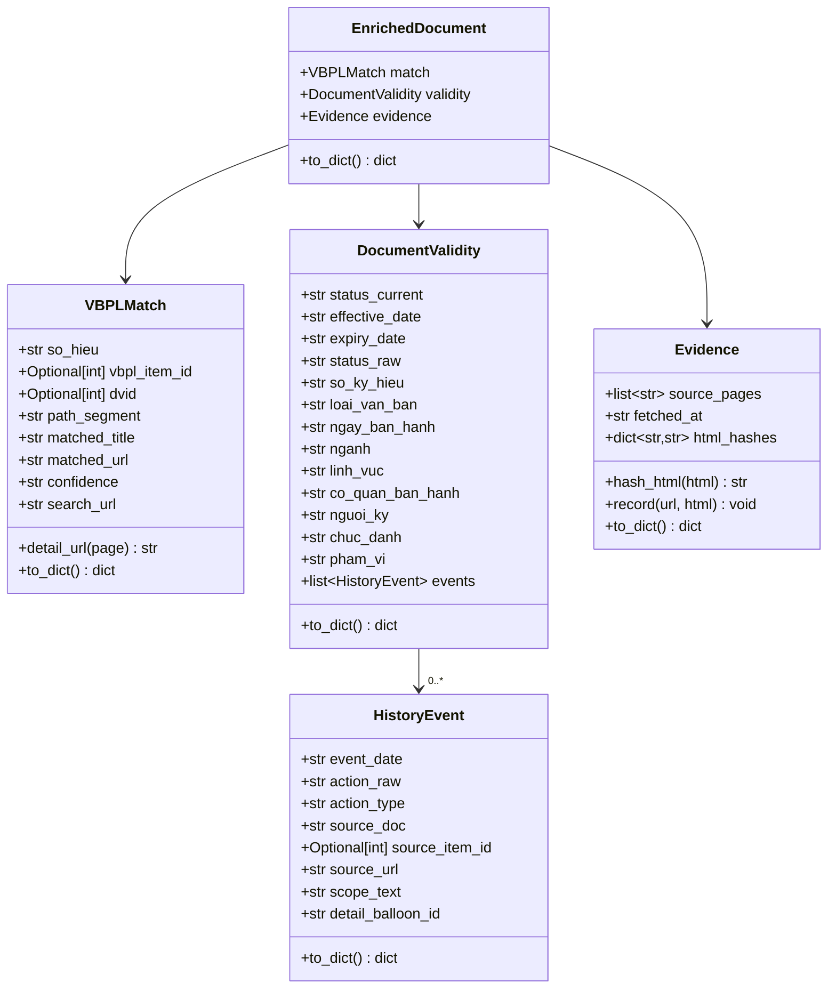

### `VBPLMatch` — Search Result Coordinates

```python
@dataclass
class VBPLMatch:
    so_hieu: str                     # e.g. "80/2021/TT-BTC"
    vbpl_item_id: Optional[int]      # VBPL internal ID (e.g. 151086)
    dvid: Optional[int]              # NOT always 13! Extracted from redirect path
    path_segment: str = ""           # e.g. "TW", "botaichinh"
    matched_title: str = ""
    matched_url: str = ""
    confidence: str = "none"         # "exact", "fuzzy", "none"
    search_url: str = ""             # AJAX URL used (for reproducibility)

    def detail_url(self, page: str) -> str:
        """Build URL for thuoctinh / lichsu / toanvan pages."""
        return f"https://vbpl.vn/{self.path_segment}/Pages/{page}.aspx?ItemID={self.vbpl_item_id}"
```

### `HistoryEvent` — One Row from Lịch sử

```python
@dataclass
class HistoryEvent:
    event_date: str                  # dd/mm/yyyy
    action_raw: str                  # Original Vietnamese text
    action_type: str                 # Normalised via ACTION_MAP
    source_doc: str                  # Số hiệu of doc that caused the event
    source_item_id: Optional[int]    # VBPL ItemID of source doc
    source_url: str = ""             # Full URL to source doc
    scope_text: str = ""             # Balloon content ("Điểm c khoản 2 Điều 8…")
    detail_balloon_id: str = ""      # e.g. "balloon_40742_9"
```

### `DocumentValidity` — Full Enriched Metadata

```python
@dataclass
class DocumentValidity:
    status_current: str = "unknown"  # valid|expired|partial|not_yet_effective|suspended|unknown
    effective_date: str = ""
    expiry_date: str = ""
    status_raw: str = ""
    so_ky_hieu: str = ""
    loai_van_ban: str = ""
    ngay_ban_hanh: str = ""
    nganh: str = ""
    linh_vuc: str = ""
    co_quan_ban_hanh: str = ""
    nguoi_ky: str = ""
    chuc_danh: str = ""
    pham_vi: str = ""
    events: list[HistoryEvent] = field(default_factory=list)
```

### `Evidence` — Audit Trail

```python
@dataclass
class Evidence:
    source_pages: list[str] = field(default_factory=list)
    fetched_at: str = ""
    html_hashes: dict[str, str] = field(default_factory=dict)  # {url: md5}

    @staticmethod
    def hash_html(html: str) -> str:
        return hashlib.md5(html.encode("utf-8", errors="replace")).hexdigest()

    def record(self, url: str, html: str):
        self.source_pages.append(url)
        self.html_hashes[url] = self.hash_html(html)
        self.fetched_at = datetime.now().isoformat()
```

This enables:
- **Reproducibility**: Re-fetch the exact URLs to verify data
- **Change detection**: Compare HTML hashes to detect if a page has been updated since last scrape
- **Compliance**: Audit trail for legal document metadata

### Confidence Levels

| Level | Meaning | How Determined |
|-------|---------|----------------|
| `exact` | Matched by so_hieu in title text or single-result JS redirect | High reliability |
| `fuzzy` | First result returned, title doesn't exactly match so_hieu | May be wrong, needs human review |
| `none` | No results found on vbpl.vn | Document may be too old, local/provincial, or not in VBPL database |

### Serialisation

All dataclasses implement `to_dict()` via `dataclasses.asdict()`, producing nested JSON-safe dictionaries. `EnrichedDocument.to_dict()` calls child `to_dict()` recursively.

---

## 8. Parser Module — Structural Parsing

> **Directory**: `parsers/` (5 files + `__pycache__/`)
> **Purpose**: Parse HTML content from legal documents into structured hierarchical JSON trees
> **Entry point**: `get_parser(doc_type)` factory function from `parsers/__init__.py`

### Parser Architecture

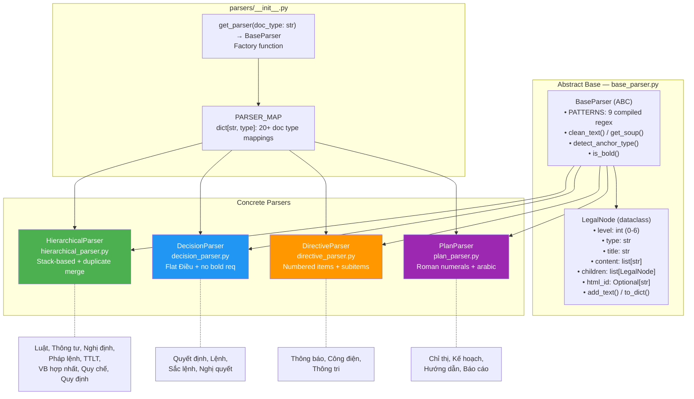

### PARSER_MAP — Complete Mapping (20+ entries)

```python
PARSER_MAP = {
    # Hierarchical documents (complex structure)
    "Luật":                HierarchicalParser,
    "Thông tư":            HierarchicalParser,
    "Thông tư liên tịch":  HierarchicalParser,
    "Nghị định":           HierarchicalParser,
    "Pháp lệnh":          HierarchicalParser,
    "Văn bản hợp nhất":   HierarchicalParser,
    "Quy chế":            HierarchicalParser,
    "Quy định":           HierarchicalParser,
    
    # Decision-style (short, with Điều)
    "Quyết định":  DecisionParser,
    "Lệnh":       DecisionParser,
    "Sắc lệnh":   DecisionParser,
    "Nghị quyết":  DecisionParser,
    
    # Directive-style (simple numbered paragraphs)
    "Thông báo":  DirectiveParser,
    "Công điện":  DirectiveParser,
    "Thông tri":  DirectiveParser,
    
    # Plan-style (Roman numerals + sections)
    "Chỉ thị":   PlanParser,
    "Kế hoạch":   PlanParser,
    "Hướng dẫn":  PlanParser,
    "Báo cáo":    PlanParser,
}

# Fallback for unknown types:
def get_parser(doc_type: str) -> BaseParser:
    parser_class = PARSER_MAP.get(doc_type, HierarchicalParser)  # default = Hierarchical
    return parser_class()
```

### LegalNode — Hierarchy Levels

| Level | Type | Example | Regex / Detection |
|-------|------|---------|-------------------|
| 0 | `document` | Root node | Auto-created |
| 1 | `part` | `Phần thứ nhất` | Regex `Phần\s+(thứ\s+)?[IVX]+` or anchor `phan_*` |
| 2 | `chapter` | `Chương I` | Regex `Chương\s+[IVX0-9]+` or anchor `chuong_*` |
| 3 | `section` | `Mục 1` | Regex `Mục\s+[0-9]+` or anchor `muc_*` |
| 4 | `article` | `Điều 1. Phạm vi` | Regex `Điều\s+\d+` or anchor `dieu_*` |
| 5 | `clause` | `1. Thuế suất...` | Regex `\d+(\.\d+)*\.?\s+(.*)` (context-dependent) |
| 6 | `point` | `a) Trường hợp...` | Regex `[a-zđ][\)\\.]\s+(.*)` |

### LegalNode — Dataclass

```python
@dataclass
class LegalNode:
    level: int           # 0-6
    type: str            # 'document', 'part', 'chapter', etc.
    title: str           # e.g., "Điều 1. Phạm vi điều chỉnh"
    content: List[str]   # Body text lines (default: [])
    children: List['LegalNode']  # Child nodes (default: [])
    html_id: Optional[str]       # Original HTML anchor id (e.g. "dieu_1")

    def add_text(self, text: str):
        if text.strip():
            self.content.append(text.strip())

    def to_dict(self) -> Dict[str, Any]:
        data = {"type": self.type, "title": self.title}
        if self.html_id:     data["html_id"] = self.html_id
        full_content = "\n".join(self.content).strip()
        if full_content:     data["content"] = full_content
        if self.children:    data["children"] = [c.to_dict() for c in self.children]
        return data
```

### BaseParser — Shared Components

#### 9 Compiled Regex Patterns

| Pattern Key | Regex | Flags | Purpose |
|-------------|-------|-------|---------|
| `part` | `r'(?:^|.*[\.\:\n]\s*)((?:Phần\s+(?:thứ\s+)?[IVX]+|PHẦN\s+(?:THỨ\s+)?[IVX]+|Phần\s+[A-Z]+|PHẦN\s+[A-Z]+).*)\s*$'` | `IGNORECASE | DOTALL` | Detect Phần |
| `chapter` | `r'(?:^|.*[\.\:\n]\s*)(((?:Chương\s+[IVX0-9]+|CHƯƠNG\s+[IVX0-9]+)|(?:[IVX]+)\.\s+).*)\s*$'` | `IGNORECASE | DOTALL` | Detect Chương |
| `section` | `r'(?:^|.*[\.\:\n]\s*)((?:Mục\s+[0-9]+|MỤC\s+[0-9]+).*)\s*$'` | `IGNORECASE | DOTALL` | Detect Mục |
| `article` | `r'^\s*(Điều\s+\d+|ĐIỀU\s+\d+)[\.:]?\s*(.*)'` | `IGNORECASE` | Detect Điều |
| `point` | `r'^\s*([a-zđ])[\)\\.]\s+(.*)'` | `IGNORECASE` | Detect Điểm (a, b, c...) |
| `appendix` | `r'^\s*(Phụ lục|PHỤ LỤC|Mẫu số|MẪU SỐ)\s+[0-9IVX]*.*\s*$'` | `IGNORECASE` | Detect Phụ lục |
| `recipients` | `r'^\s*(Nơi nhận|Nơi gửi)[:;]\s*(.*)'` | `IGNORECASE` | Detect Nơi nhận |
| `signature` | `r'^\s*(TM\.|KT\.|TL\.|PP\.|CHỦ TỊCH|THỦ TƯỚNG|BỘ TRƯỞNG|...)\s*$'` | `IGNORECASE` | Detect signature block |
| `loose_numbering` | `r'^\s*(\d+(\.\d+)*)\.?\s+(.*)'` | — | Detect numbered items (1., 2.1, etc.) |

#### HTML Preprocessing (`get_soup`)

```python
def get_soup(self, html_content: str) -> BeautifulSoup:
    soup = BeautifulSoup(html_content, 'html.parser')
    # Content container priority:
    #   1. div.content1 → 2. div#contentBody → 3. body → 4. soup root
    content_div = (
        soup.find('div', class_='content1') or
        soup.find('div', id='contentBody') or
        soup.body or soup
    )
    # Clean: remove <script>, <style>, <iframe>
    for tag in content_div.find_all(['script', 'style', 'iframe']):
        tag.extract()
    return content_div
```

#### Anchor Detection (`detect_anchor_type`)

VBPL HTML uses `<a name="dieu_1">`, `<a name="chuong_2">` as structural markers:

```python
def detect_anchor_type(self, html_id: Optional[str]) -> Optional[str]:
    if not html_id: return None
    if html_id.endswith('_name'): return None  # Title markers, not structure
    if html_id.startswith('dieu_'):    return 'article'
    elif html_id.startswith('chuong_'): return 'chapter'
    elif html_id.startswith('phan_'):   return 'part'
    elif html_id.startswith('muc_'):    return 'section'
    elif html_id.startswith('khoan_'):  return 'clause'
    return None
```

#### Bold Detection (`is_bold`)

```python
def is_bold(self, element) -> bool:
    if element.find('b') or element.find('strong'): return True
    if element.name in ['h3', 'h4', 'h5']: return True
    return False
```

#### Text Cleaning (`clean_text`)

```python
def clean_text(self, text: str) -> str:
    return re.sub(r'\s+', ' ', text.replace('\xa0', ' ').replace('\r', '')).strip()
```

### HierarchicalParser — Stack-Based Algorithm

The most complex parser. Handles `Luật`, `Nghị định`, `Thông tư`, etc. (8 doc types).

#### Algorithm Flow

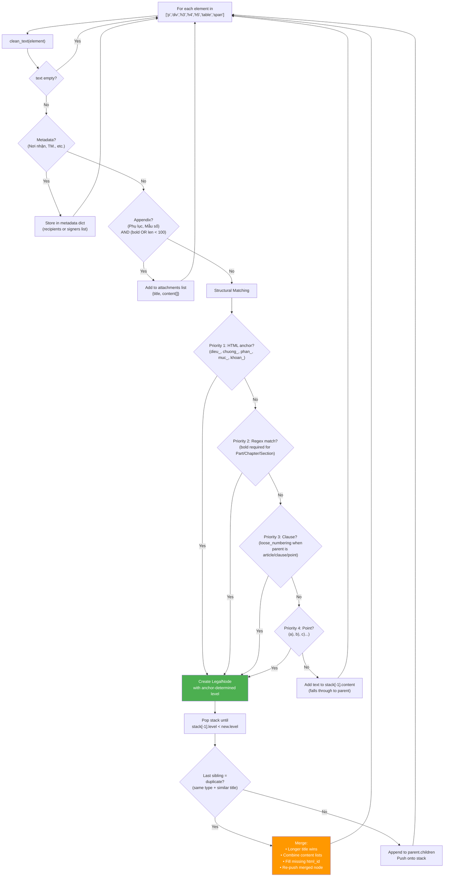

#### Duplicate Merging

VBPL HTML often contains the same structural element twice (once as anchor `<a name="dieu_1">`, once as formatted text `<b>Điều 1...</b>`). The parser detects and merges these:

```python
def _is_duplicate(self, node1, node2) -> bool:
    if node1.type != node2.type: return False
    t1 = clean(node1.title).lower().rstrip('.')
    t2 = clean(node2.title).lower().rstrip('.')
    
    if t1 == t2: return True                                     # exact
    if t1.startswith(t2 + ".") or t1.startswith(t2 + " "): return True  # prefix
    if t2.startswith(t1 + ".") or t2.startswith(t1 + " "): return True  # prefix
    return False
```

Merge strategy:
- **Title**: longer one wins
- **Content**: concatenate content lists
- **html_id**: fill from whichever has it
- **Stack**: re-push merged node so children attach correctly

#### Metadata State Machine

```python
# Metadata parsing uses a boolean flag is_parsing_metadata
# Once a "Nơi nhận" or signature pattern is found, all subsequent
# short text (<50 chars, uppercase or dash-prefixed) goes into
# metadata.recipients or metadata.signers

# Exit condition: a structural anchor or pattern is found
if anchor_type or any(structural_pattern.match(text)):
    is_parsing_metadata = False
```

#### Appendix State Machine

```python
# When "Phụ lục" / "PHỤ LỤC" / "Mẫu số" detected (bold or <100 chars):
is_parsing_appendices = True
attachments.append({"title": text, "content": []})

# All subsequent text goes into current attachment.content
# Exit: recipients or signature pattern → switch to metadata mode
```

### DecisionParser — Flat Article Structure

For `Quyết định`, `Lệnh`, `Nghị quyết` — typically short documents with 2–5 Điều.

**Key differences from Hierarchical**:
- **No Part/Chapter/Section levels** — directly `Điều → Khoản → Điểm`
- **Articles accepted without bold requirement** (decision articles are often not bold)
- Only processes elements: `['p', 'div', 'h3', 'h4', 'h5']` (no `table`, `span`)
- Simpler metadata detection (exit only on anchor or article pattern)

```python
# In DecisionParser, article detection:
if anchor_type == 'article':
    matched_node = LegalNode(4, "article", text, html_id=html_id)
elif self.PATTERNS['article'].match(text):
    # No is_bold check needed!
    matched_node = LegalNode(4, "article", text, html_id=html_id)
```

### DirectiveParser — Numbered Paragraphs

For `Thông báo`, `Công điện`, `Thông tri` — no formal `Điều` structure.

**Key differences**:
- Uses **numbered items** as primary structure (level 4 = `item`):
  - Top-level: `1.`, `2.`, `3.` → `LegalNode(4, "item")`
  - Sub-items: `1.1`, `2.1` → `LegalNode(5, "subitem")`
- Points: `a)`, `b)` → `LegalNode(6, "point")`
- No article/chapter/section/part detection
- Metadata exits on: length < 60 chars threshold

```python
# Sub-item detection logic:
if '.' in number:  # "1.1", "2.1" = sub-item
    matched_node = LegalNode(5, "subitem", number)
else:
    matched_node = LegalNode(4, "item", number)  # sibling
```

### PlanParser — Roman Numeral Sections

For `Chỉ thị`, `Kế hoạch`, `Hướng dẫn`, `Báo cáo` — Roman numeral headings.

**Key differences**:
- **Custom regex**: `ROMAN_SECTION = re.compile(r'^\s*([IVX]+)\.\s*(.*)', re.IGNORECASE)`
- Bold Roman numerals → `LegalNode(2, "section")` (level 2)
- Arabic numbered items → `LegalNode(4, "item")` (level 4)
- Points → `LegalNode(6, "point")` (level 6)
- Only sections when `is_bold` is True (prevents false positives)

```python
if (match := self.ROMAN_SECTION.match(text)) and is_bold:
    roman = match.group(1)   # "I", "II", "III"
    section_title = match.group(2)
    matched_node = LegalNode(2, "section", f"{roman}. {section_title}")
```

### Parser Output Format (All Parsers)

All 4 parsers return the same JSON structure:

```json
{
  "structure": {
    "type": "document",
    "title": "Luật Thuế thu nhập cá nhân",
    "children": [
      {
        "type": "chapter",
        "title": "Chương I QUY ĐỊNH CHUNG",
        "html_id": "chuong_1",
        "children": [
          {
            "type": "article",
            "title": "Điều 1. Phạm vi điều chỉnh",
            "html_id": "dieu_1",
            "content": "Luật này quy định về...",
            "children": [
              {
                "type": "clause",
                "title": "1",
                "content": "Thu nhập từ kinh doanh..."
              },
              {
                "type": "point",
                "title": "a) Trường hợp...",
                "content": ""
              }
            ]
          }
        ]
      }
    ]
  },
  "metadata": {
    "recipients": ["Nơi nhận: - Thủ tướng CP..."],
    "signers": ["BỘ TRƯỞNG", "Nguyễn Văn A"]
  },
  "attachments": [
    {"title": "PHỤ LỤC I", "content": "Bảng thuế suất..."}
  ]
}
```

---

## 9. Batch Enrichment Pipeline (`run_tax_enrichment.py`)

> **File**: `run_tax_enrichment.py` (303 lines)
> **Purpose**: Orchestrate batch enrichment of **existing** documents from `data_universal`
> **4 modes**: `cache`, `run`, `stats`, `all`

### Pipeline Modes

```bash
# Mode 1: Build cache from dataset (run once, avoids slow Arrow loading)
python3 run_tax_enrichment.py cache

# Mode 2: Run enrichment (uses cached doc list, checkpoints to JSONL)
python3 run_tax_enrichment.py run [--limit N] [--fresh]

# Mode 3: Compute statistics from completed JSONL
python3 run_tax_enrichment.py stats

# Mode 4: All three steps sequentially
python3 run_tax_enrichment.py all
```

### Pipeline Flow

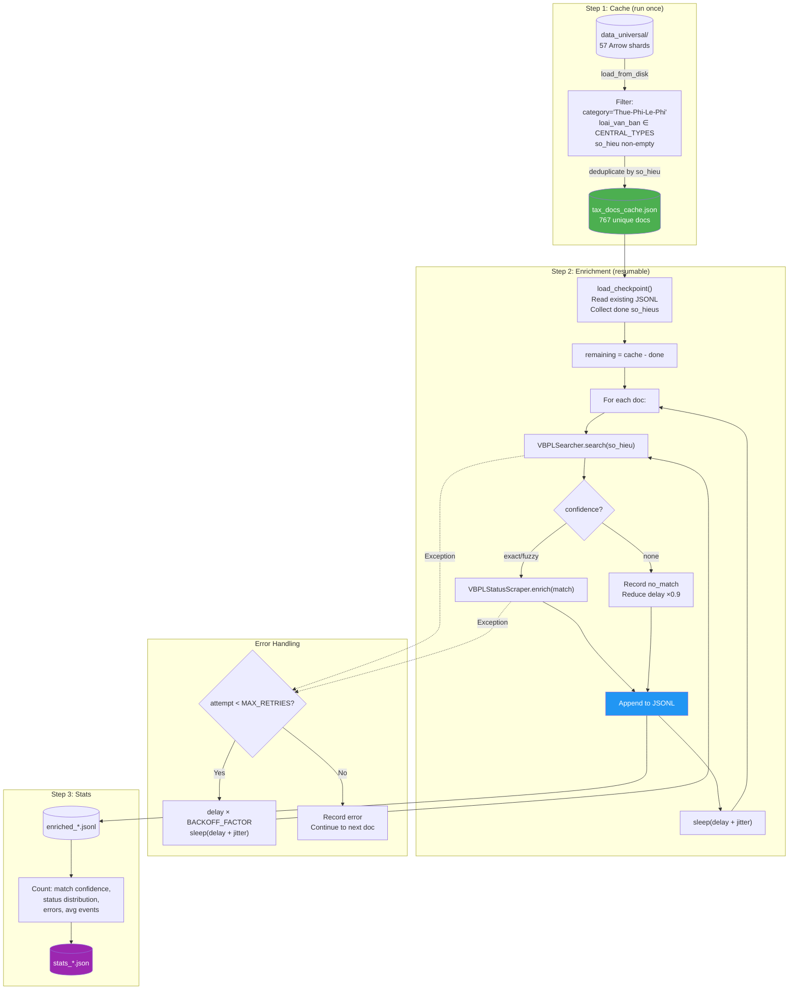

### Cache Step — Why It Exists

The dataset (`data_universal/`) is stored on an **external NTFS drive** with 57 Arrow shards. Loading is extremely slow:
- `load_from_disk()` → ~30 seconds
- Column batch access → **minutes** (sequential reads across 57 files on NTFS)

**Solution**: The `cache` step runs once, reads all columns, filters to tax/fee/levy category, deduplicates by `so_hieu`, and writes a small JSON file (~200KB). The `run` step reads from this cache — **instant loading**.

#### Cache Building Code

```python
CENTRAL_TYPES = {"Luật", "Nghị định", "Thông tư", "Thông tư liên tịch", "Pháp lệnh"}

# For each row: keep if category == "Thue-Phi-Le-Phi"
#               AND loai_van_ban ∈ CENTRAL_TYPES
#               AND so_hieu is non-empty
# Deduplicate by so_hieu
# Saved fields: so_hieu, title, loai_van_ban, category, tinh_trang, ngay_ban_hanh, link
```

### Stats Output

The `stats` mode reads the JSONL and computes:

| Metric | Description |
|--------|-------------|
| `total` | Number of processed documents |
| `match_confidence` | Counter: `{exact: N, fuzzy: N, none: N}` |
| `status_distribution` | Counter: `{valid: N, expired: N, partial: N, ...}` |
| `errors` | Count of documents with errors |
| `avg_events` | Average history events per document |
| `max_events` | Maximum events on any document |
| `with_events` | Documents that have ≥1 history event |

---

## 10. New Document Discovery Pipeline (`discover_new_documents.py`)

> **File**: `discover_new_documents.py` (797 lines)
> **Purpose**: Find and fully process **new** documents from vbpl.vn that don't exist in `data_universal`
> **Key Feature**: **Weekly chunking** with per-chunk checkpoint/resume
> **3 modes**: Weekly discovery, Single document, Stats

### CLI Interface

```bash
# Weekly crawl (default: 7-day chunks, auto-resumes)
python3 discover_new_documents.py --from-date 01/01/2024 --doc-type Luật

# Monthly chunks instead of weekly
python3 discover_new_documents.py --from-date 01/01/2024 --chunk-days 30

# Limit total documents across all weeks
python3 discover_new_documents.py --from-date 01/01/2025 --limit 10

# Skip filtering against existing DB
python3 discover_new_documents.py --from-date 01/01/2025 --skip-filter

# Fresh start (clear all checkpoints)
python3 discover_new_documents.py --from-date 01/01/2024 --fresh

# Single document mode (by số hiệu)
python3 discover_new_documents.py --so-hieu "100/2024/ND-CP"

# Show stats from previous runs
python3 discover_new_documents.py --stats
```

### CLI Arguments — Complete Reference

| Argument | Type | Default | Description |
|----------|------|---------|-------------|
| `--so-hieu` | `str` | `None` | Single document mode: process one doc by số hiệu |
| `--from-date` | `str` | `01/01/2024` | Start date `dd/mm/yyyy` |
| `--to-date` | `str` | today | End date `dd/mm/yyyy` |
| `--doc-type` | `str` | `None` (ALL) | Filter by doc type (e.g. `Luật`, `Nghị định`) |
| `--chunk-days` | `int` | `7` | Days per chunk (7=weekly, 30=monthly) |
| `--limit` | `int` | `0` (unlimited) | Max TOTAL documents to process across ALL weeks |
| `--max-pages` | `int` | `100` | Max browse pages per week chunk (50 docs/page) |
| `--skip-filter` | flag | `False` | Skip filtering against existing database |
| `--fresh` | flag | `False` | Clear week checkpoint + output JSONL and start over |
| `--stats` | flag | `False` | Show statistics from previous runs |

### Weekly Chunking — Core Innovation

**Problem**: vbpl.vn search returns max ~500 results per query. A 2-year range (2024→2026) would miss documents.

**Solution**: Split date range into small chunks (default 7 days), process each chunk independently.

#### `generate_weekly_chunks()` — Date Splitting

```python
def generate_weekly_chunks(from_date: str, to_date: str, chunk_days: int = 7) -> list[tuple[str, str]]:
    """
    Split [from_date, to_date] into chunks of chunk_days days.
    Returns list of (start_dd/mm/yyyy, end_dd/mm/yyyy).
    """
    start = _parse_vn_date(from_date)    # datetime.strptime(s, "%d/%m/%Y")
    end = _parse_vn_date(to_date)
    chunks = []
    cursor = start
    while cursor <= end:
        chunk_end = min(cursor + timedelta(days=chunk_days - 1), end)
        chunks.append((_fmt_vn_date(cursor), _fmt_vn_date(chunk_end)))
        cursor = chunk_end + timedelta(days=1)
    return chunks
```

Example:
```
generate_weekly_chunks("01/01/2025", "22/01/2025", chunk_days=7)
→ [("01/01/2025", "07/01/2025"),
   ("08/01/2025", "14/01/2025"),
   ("15/01/2025", "22/01/2025")]
```

For the full range `01/01/2025 → 08/02/2026` with `chunk_days=7`:
→ **58 weekly chunks**

#### Date Utility Functions

```python
def _parse_vn_date(s: str) -> datetime:
    return datetime.strptime(s.strip(), "%d/%m/%Y")

def _fmt_vn_date(dt: datetime) -> str:
    return dt.strftime("%d/%m/%Y")
```

### 3-Tier Checkpoint/Resume System

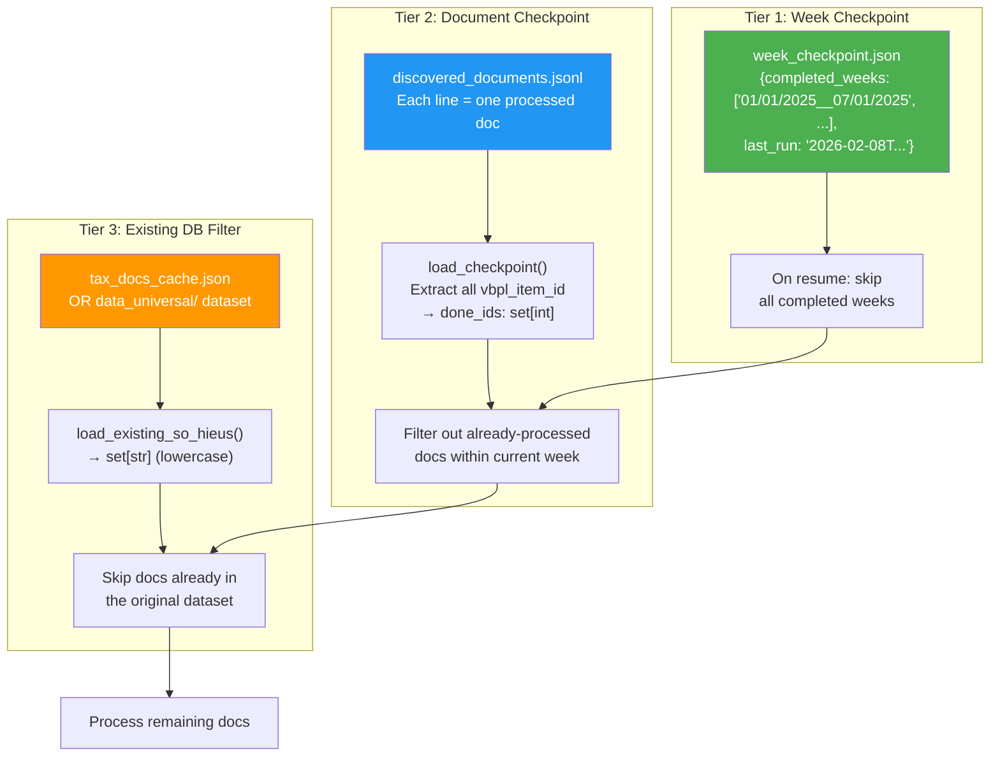

#### Week Checkpoint File Format

```json
{
  "completed_weeks": [
    "01/01/2025__07/01/2025",
    "08/01/2025__14/01/2025"
  ],
  "last_run": "2026-02-08T17:37:42.123456"
}
```

Key format: `{start_date}__{end_date}` (double underscore separator)

#### Week Checkpoint Functions

```python
def load_week_checkpoint() -> dict:
    if WEEK_CHECKPOINT.exists():
        return json.load(open(WEEK_CHECKPOINT))
    return {"completed_weeks": [], "last_run": None}

def save_week_checkpoint(ckpt: dict):
    ckpt["last_run"] = datetime.now().isoformat()
    json.dump(ckpt, open(WEEK_CHECKPOINT, "w"), ensure_ascii=False, indent=2)
```

#### Document Checkpoint

```python
def load_checkpoint() -> set[int]:
    """Read existing JSONL, extract all vbpl_item_id → set[int]."""
    done = set()
    if JSONL_FILE.exists():
        for line in open(JSONL_FILE):
            r = json.loads(line)
            item_id = r.get("match", {}).get("vbpl_item_id")
            if item_id:
                done.add(int(item_id))
    return done
```

#### Existing DB Filter

```python
def load_existing_so_hieus() -> set[str]:
    """Load from cache first (fast), fallback to dataset (slow)."""
    # Priority 1: tax_docs_cache.json (instant)
    cache = ROOT / "outputs" / "enrichment" / "tax_docs_cache.json"
    if cache.exists():
        return {d["so_hieu"].strip().lower() for d in json.load(open(cache))}

    # Priority 2: data_universal/ (slow on NTFS)
    try:
        from datasets import load_from_disk
        ds = load_from_disk(str(ROOT / "data_universal"))
        return {s.strip().lower() for s in ds["train"]["so_hieu"] if s}
    except: pass

    return set()  # No filter
```

### `run_discover()` — Weekly Discovery Flow

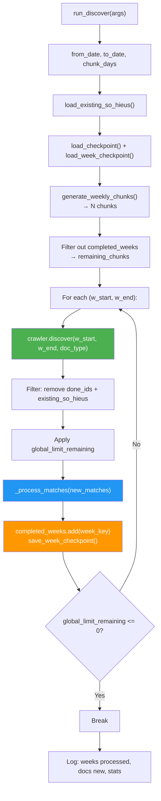

### `process_one_document()` — Full Single-Doc Pipeline

This is the core function shared by both discovery and single-doc modes:

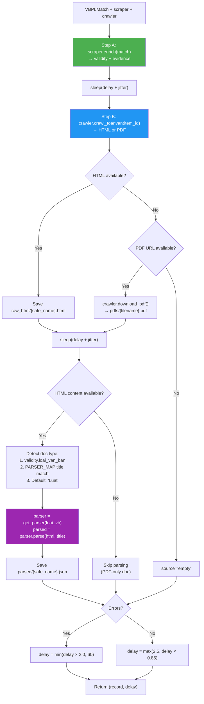

#### Parser Type Auto-Detection Logic

```python
# Priority 1: Use loai_van_ban from enrichment (thuộc tính page)
loai_vb = record["validity"].get("loai_van_ban", "Luật") or "Luật"

# Priority 2: If still default, scan matched title against PARSER_MAP keys
if not loai_vb or loai_vb == "Luật":
    for doc_type in PARSER_MAP:
        if doc_type.lower() in match.matched_title.lower():
            loai_vb = doc_type
            break

# Priority 3: Fallback
parser = get_parser(loai_vb)  # PARSER_MAP.get(loai_vb, HierarchicalParser)
```

#### Safe Filename Generation

```python
safe_name = so_hieu.replace("/", "_").replace("\\", "_").replace(" ", "_")
# "80/2021/TT-BTC" → "80_2021_TT-BTC"
```

### `_process_matches()` — Shared Match Processor

Used by both `run_discover()` (weekly mode) and could be reused:

```python
def _process_matches(matches, scraper, crawler, stats, current_delay, limit=0) -> float:
    """
    Process a list of VBPLMatch objects with retry, JSONL writing, and stats.
    Returns updated delay.
    """
    # For each match:
    #   1. Retry up to MAX_RETRIES times
    #   2. Call process_one_document()
    #   3. Append result to JSONL
    #   4. Update stats counter (success/error/html/pdf/parsed)
    #   5. Sleep between documents
```

Stats counters tracked:

| Counter | When Incremented |
|---------|-----------------|
| `success` | No error in record |
| `error` | Record has error |
| `html` | `toanvan.source == "html"` |
| `pdf` | `toanvan.source == "pdf"` |
| `parsed` | Record has parsed section |
| `week_errors` | Week-level discovery failure |

### `run_single()` — Single Document Mode

For processing one specific document by `so_hieu`:

```
python3 discover_new_documents.py --so-hieu "100/2024/ND-CP"
```

Flow: `VBPLSearcher.search()` → `process_one_document()` → pretty-print summary + write JSONL

Pretty-printed output includes:
- Trạng thái, Hiệu lực từ, Ngày ban hành, Cơ quan, Lĩnh vực, Lịch sử events count
- Toàn văn source, HTML/text char counts, PDF URL
- Parser used, total nodes, node type breakdown, parsed file path

### `show_stats()` — Statistics Display

Reads JSONL and computes:

| Metric | Description |
|--------|-------------|
| `total` | Total documents |
| `errors` | Count with error field |
| `with_validity` | Count with validity data |
| `with_toanvan` | Count with toàn văn fetched |
| `with_parsed` | Count successfully parsed |
| `confidence_dist` | Counter: exact/fuzzy/none |
| `source_dist` | Counter: html/pdf/none |
| `status_dist` | Counter: valid/expired/partial/... |
| `parser_dist` | Counter: HierarchicalParser/DecisionParser/... |

### `--fresh` Flag Behaviour

```python
if args.fresh:
    if WEEK_CHECKPOINT.exists():
        WEEK_CHECKPOINT.unlink()    # Delete week_checkpoint.json
    if JSONL_FILE.exists():
        JSONL_FILE.unlink()         # Delete discovered_documents.jsonl
```

### Discovery JSONL Record Schema

Each line in `discovered_documents.jsonl`:

```json
{
  "match": {
    "so_hieu": "100/2024/ND-CP",
    "vbpl_item_id": 169712,
    "dvid": null,
    "path_segment": "TW",
    "matched_title": "Nghị định 100/2024/NĐ-CP...",
    "matched_url": "https://vbpl.vn/TW/Pages/...",
    "confidence": "exact",
    "search_url": ""
  },
  "validity": {
    "status_current": "partial",
    "effective_date": "01/08/2024",
    "ngay_ban_hanh": "26/07/2024",
    "co_quan_ban_hanh": "Chính phủ",
    "events": [ ... ]
  },
  "evidence": {
    "source_pages": ["https://vbpl.vn/.../thuoctinh...", "https://vbpl.vn/.../lichsu..."],
    "fetched_at": "2026-02-08T17:32:30...",
    "html_hashes": {"url1": "md5_1", "url2": "md5_2"}
  },
  "toanvan": {
    "source": "html",
    "content_text_len": 151257,
    "content_html_len": 177281,
    "pdf_url": null,
    "pdf_filename": null
  },
  "parsed": {
    "parser": "HierarchicalParser",
    "doc_type": "Nghị định",
    "total_nodes": 419,
    "node_types": {"clause": 198, "point": 193, "section": 17, "chapter": 8, "article": 2, "document": 1},
    "parsed_file": "/path/to/parsed/100_2024_ND-CP.json"
  },
  "error": null,
  "processed_at": "2026-02-08T17:32:42.123456"
}
```

### Node Count Utilities

```python
def _count_nodes(node: dict) -> int:
    """Recursive count of all nodes in tree."""
    total = 1
    for child in node.get("children", []):
        total += _count_nodes(child)
    return total

def _count_by_type(node: dict) -> dict:
    """Recursive count by type → {type: count}."""
    counts = {}
    _count_by_type_recursive(node, counts)
    return counts
```

---

## 11. Rate Limiting & Anti-Block Strategy

### Parameters (Shared by Both Pipelines)

| Parameter | Value | Defined In | Description |
|-----------|-------|------------|-------------|
| `BASE_DELAY` | `2.5 s` | Both scripts | Minimum wait between requests |
| `JITTER_MAX` | `1.0 s` | Both scripts | Random jitter: `uniform(0, 1.0)` |
| `BACKOFF_FACTOR` | `2.0` | Both scripts | Multiply delay on error |
| `MAX_DELAY` | `60.0 s` | Both scripts | Cap on adaptive delay |
| `MAX_RETRIES` | `3` | Both scripts | Retry attempts per document |
| HTTP Timeout | `30 s` | All crawlers | `requests.get(url, timeout=30)` |
| PDF Timeout | `60 s` | `VBPLCrawler` | `requests.get(pdf_url, timeout=60, stream=True)` |
| PDF Chunk | `8192 bytes` | `VBPLCrawler` | `iter_content(chunk_size=8192)` |

### Crawler-Level Delay (Module Defaults)

| Module | Default Delay | Used When |
|--------|--------------|-----------|
| `VBPLSearcher` | `1.0 s` | Job A: search only |
| `VBPLStatusScraper` | `1.0 s` | Job B: enrich only |
| `VBPLCrawler` | `1.5 s` | Job C: browse + crawl |

When called from orchestrators (both scripts), delay is overridden to `BASE_DELAY = 2.5 s`.

### Adaptive Delay Algorithm

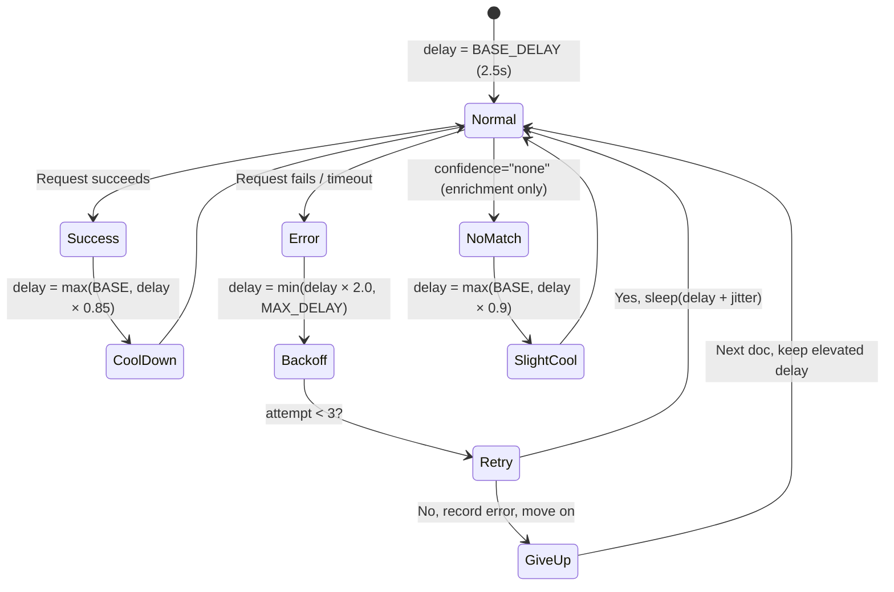

### Effective Request Pattern (Discovery Pipeline)

Each document in the discovery pipeline requires **4–5 HTTP requests**:

| # | Request | Target |
|---|---------|--------|
| 1 | Browse page (per week chunk) | `/pKetQuaTimKiem.aspx?fromyear=...` |
| 2 | Thuộc tính | `vbpq-thuoctinh.aspx?ItemID=...` |
| 3 | Lịch sử | `vbpq-lichsu.aspx?ItemID=...` |
| 4 | Toàn văn page | `vbpq-toanvan.aspx?ItemID=...` |
| 5 | PDF AJAX (if needed) | `pViewVBGoc.aspx?...` |
| 6 | PDF download (if available) | Direct PDF URL |

With delays between each: `~2.5 + 1.0 + 2.5 + 2.5 + 2.5 = ~11s per document`

### HTTP Headers (All Modules)

```python
HEADERS = {
    "User-Agent": "Mozilla/5.0 (X11; Linux x86_64) AppleWebKit/537.36 "
                  "(KHTML, like Gecko) Chrome/120.0.0.0 Safari/537.36"
}
# All modules use requests.Session() → persistent TCP connection + cookie handling
```

### `_rate_limit()` Implementation (All 3 Modules)

```python
def _rate_limit(self):
    elapsed = time.time() - self._last_request_time
    if elapsed < self.delay:
        time.sleep(self.delay - elapsed)
    self._last_request_time = time.time()
```

---

## 12. Output Format, Checkpoints & Resume

### Output File Map

#### Pipeline 1 — Enrichment

| File | Path | Format | Description |
|------|------|--------|-------------|
| Cache | `outputs/enrichment/tax_docs_cache.json` | JSON array | 767 docs with so_hieu, title, type |
| Results | `outputs/enrichment/enriched_thue_phi_le_phi.jsonl` | JSONL | One record per line, append-only |
| Stats | `outputs/enrichment/stats_thue_phi_le_phi.json` | JSON | Aggregated statistics |

#### Pipeline 2 — Discovery

| File | Path | Format | Description |
|------|------|--------|-------------|
| Results | `outputs/new_documents/discovered_documents.jsonl` | JSONL | One record per line, append-only |
| Week Checkpoint | `outputs/new_documents/week_checkpoint.json` | JSON | Completed week list |
| Parsed Trees | `outputs/new_documents/parsed/{safe_name}.json` | JSON | Structured parse trees |
| Raw HTML | `outputs/new_documents/raw_html/{safe_name}.html` | HTML | Raw `div#toanvancontent` HTML |
| PDFs | `outputs/new_documents/pdfs/{filename}.pdf` | Binary | Downloaded PDF files |

#### Demo

| File | Path | Format | Description |
|------|------|--------|-------------|
| Match | `outputs/demos/demo_match.json` | JSON | Search result |
| Enriched | `outputs/demos/demo_enriched.json` | JSON | Enrichment result |
| Toàn văn | `outputs/demos/demo_toanvan.json` | JSON | Crawl summary |
| Raw HTML | `outputs/demos/demo_toanvan_raw.html` | HTML | Raw HTML for parsing |
| Parsed | `outputs/demos/demo_parsed.json` | JSON | Parse tree |

### Enrichment JSONL Record Schema

```json
{
  "original": {
    "so_hieu": "80/2021/TT-BTC",
    "title": "Thông tư hướng dẫn...",
    "loai_van_ban": "Thông tư",
    "category": "Thue-Phi-Le-Phi",
    "tinh_trang": "Còn hiệu lực",
    "ngay_ban_hanh": "09/10/2021",
    "link": "https://thuvienphapluat.vn/..."
  },
  "match": { "so_hieu": "...", "vbpl_item_id": 151086, "confidence": "exact", ... },
  "validity": { "status_current": "valid", "events": [...], ... },
  "evidence": { "source_pages": [...], "fetched_at": "...", "html_hashes": {...} },
  "error": null
}
```

### Resume Mechanism Comparison

| Feature | Pipeline 1 (Enrichment) | Pipeline 2 (Discovery) |
|---------|------------------------|----------------------|
| Checkpoint level | Document-level (so_hieu) | Week-level + Document-level (ItemID) |
| Checkpoint file | JSONL itself | `week_checkpoint.json` + JSONL |
| Resume key | `so_hieu` in JSONL | `{start}__{end}` in week_checkpoint + `vbpl_item_id` in JSONL |
| Fresh start | `--fresh` flag → delete JSONL | `--fresh` flag → delete both files |
| Filter existing | Implicit (cache = current dataset) | Explicit `load_existing_so_hieus()` |

---

## 13. File Reference & Dependencies

### Complete Directory Structure

```
project_root/
├── run_tax_enrichment.py              # Pipeline 1: Batch enrichment (303 lines)
├── discover_new_documents.py          # Pipeline 2: Discovery + weekly chunking (797 lines)
├── demo_parsers.py                    # Parser demo script
├── process_tax_data.py                # Tax data processing
├── requirements.txt                   # Python dependencies
├── PIPELINE_DOCUMENTATION.md          # This file
├── README.md                          # Project README
│
├── parsers/                           # Parser Engine (4 parsers)
│   ├── __init__.py                    # PARSER_MAP (20+ entries) + get_parser() factory
│   ├── base_parser.py                 # BaseParser ABC + LegalNode dataclass + 9 regex patterns
│   ├── hierarchical_parser.py         # Luật/NĐ/TT — stack-based with duplicate merge
│   ├── decision_parser.py             # QĐ/Lệnh/NQ — flat Điều, no bold req
│   ├── directive_parser.py            # TB/CĐ/Thông tri — numbered items + subitems
│   └── plan_parser.py                 # KH/HD/BC/CT — Roman sections + arabic items
│
├── src/
│   ├── crawlers/                      # Crawler Core (3 jobs + models)
│   │   ├── __init__.py                # Package exports (all classes + constants)
│   │   ├── models.py                  # Data models: VBPLMatch, DocumentValidity, HistoryEvent,
│   │   │                              #   Evidence, EnrichedDocument, STATUS_MAP, ACTION_MAP (148 lines)
│   │   ├── vbpl_searcher.py           # Job A: so_hieu → ItemID via AJAX search (249 lines)
│   │   ├── vbpl_status.py             # Job B: ItemID → validity/events via thuoctinh+lichsu (370 lines)
│   │   └── vbpl_crawler.py            # Job C: date range browse + toàn văn HTML/PDF (358 lines)
│   └── parse_law_dataset.py           # Batch parsing script
│
├── data_universal/                    # HuggingFace dataset (57 Arrow shards)
│   ├── dataset_dict.json
│   └── train/
│       ├── data-00000-of-00057.arrow
│       ├── ...
│       └── data-00056-of-00057.arrow
│
├── outputs/
│   ├── enrichment/                    # Pipeline 1 output
│   │   ├── tax_docs_cache.json        # Cached doc list (767 docs)
│   │   ├── enriched_thue_phi_le_phi.jsonl  # Enrichment results
│   │   └── stats_thue_phi_le_phi.json      # Statistics
│   │
│   ├── new_documents/                 # Pipeline 2 output
│   │   ├── discovered_documents.jsonl # Discovery results
│   │   ├── week_checkpoint.json       # Weekly checkpoint
│   │   ├── parsed/                    # Parsed JSON trees
│   │   │   ├── 64_2025_UBTVQH.json
│   │   │   ├── 100_2024_ND-CP.json
│   │   │   └── ...
│   │   ├── raw_html/                  # Raw HTML content
│   │   │   ├── 64_2025_UBTVQH.html
│   │   │   └── ...
│   │   └── pdfs/                      # Downloaded PDFs
│   │       └── VanBanGoc_10.2025.NĐ-CP_....pdf
│   │
│   ├── demos/                         # Demo output files
│   │   ├── demo_match.json
│   │   ├── demo_enriched.json
│   │   ├── demo_toanvan.json
│   │   ├── demo_toanvan_raw.html
│   │   └── demo_parsed.json
│   │
│   └── thue_phi_le_phi/               # Parsed documents by type
│       ├── Luật/                       # 16 parsed law JSONs
│       ├── Nghị định/                  # 84 parsed decree JSONs
│       ├── Thông tư/                   # 602 parsed circular JSONs
│       ├── Thông tư liên tịch/         # 56 parsed joint circular JSONs
│       └── Pháp lệnh/                 # 9 parsed ordinance JSONs
│
└── documents/                         # Raw document storage
```

### Dependencies

```
# requirements.txt
requests==2.31.0          # HTTP client for vbpl.vn
beautifulsoup4==4.12.2    # HTML parsing
lxml==4.9.3               # HTML parser backend (faster than html.parser)

# Also used (not in requirements.txt but available in venv):
datasets                  # HuggingFace Datasets (Apache Arrow loading)
tqdm                      # Progress bars
```

### Python Environment

| Property | Value |
|----------|-------|
| **Python version** | 3.13 |
| **Virtual env** | `.venv/` |
| **OS** | Linux (external NTFS drive for data) |
| **Activation** | `source .venv/bin/activate` |

### Module Import Graph

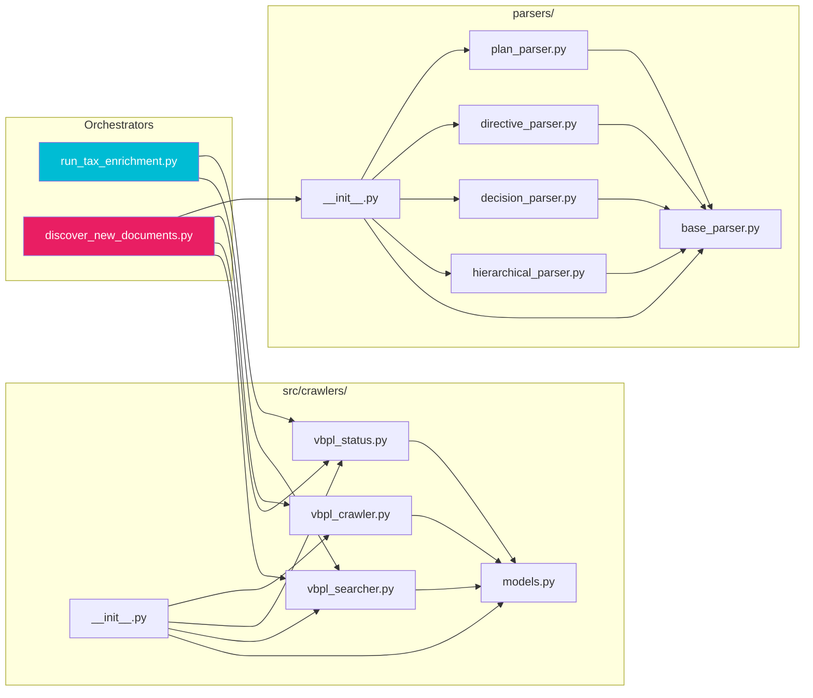

---

## 14. Demo Results

### End-to-End Demo: Luật Phí và Lệ phí (97/2015/QH13)

| Step | Module | Result |
|------|--------|--------|
| 1. Search | `VBPLSearcher` | Exact match → ItemID=96119, path_segment=TW, dvid=13 |
| 2. Enrich | `VBPLStatusScraper` | status="Hết hiệu lực một phần", 10 history events |
| 3. Crawl | `VBPLCrawler` | HTML source, 13,431 chars text / 18,539 chars HTML |
| 4. Parse | `HierarchicalParser` | 100 nodes: 7 chapters, 25 articles, 57 clauses, 10 points |

### Discovery Demo: Nghị định 100/2024/NĐ-CP (Single Doc Mode)

| Property | Value |
|----------|-------|
| Trạng thái | Hết hiệu lực một phần |
| Hiệu lực từ | 01/08/2024 |
| Ngày ban hành | 26/07/2024 |
| Cơ quan | Chính phủ |
| Lịch sử | 3 events |
| Toàn văn | HTML, 151,257 text chars / 177,281 HTML chars |
| Parser | HierarchicalParser |
| Total nodes | 419 (198 clauses, 193 points, 17 sections, 8 chapters, 2 articles) |

### Weekly Discovery Demo: Luật from Jan 2025

| Metric | Value |
|--------|-------|
| Week 1 (01/01–07/01) | 83 docs found, 2 processed (limit=2) |
| Resume test | Week 1 skipped, continued from Week 2 |
| Week 2 doc | NĐ 10/2025/NĐ-CP: PDF-only (no HTML), downloaded successfully |
| Content types | 2 HTML, 1 PDF |

### 10-Document Pilot Test (Enrichment Pipeline)

| Metric | Value |
|--------|-------|
| Total docs | 10 |
| Exact match | 9 (90%) |
| No match | 1 (10%) |
| Errors | 0 |
| Status: valid | 3 |
| Status: expired | 6 |
| Avg events/doc | 2.9 |
| Runtime | ~30 seconds |

### Complex Document Test (Luật Thuế TNCN 13/2008/QH12)

- **7 history events** extracted correctly
- **Balloon scope text** captured: exact Điều/Khoản/Điểm affected by each amendment
- All amendment source documents linked with correct ItemIDs

---

## 15. Future Work & RAG Integration

### Integration with RAG Guardrail (Module 1)

The enrichment data feeds directly into the **Input Guardrail (CRAG + FRBR Check)**:

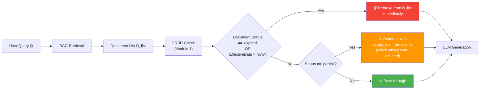

### Planned Improvements

| Area | Task | Status |
|------|------|--------|
| Gap-fill | ~~Weekly discovery pipeline~~ | ✅ Done |
| Full text | ~~HTML + PDF crawling~~ | ✅ Done |
| Checkpointing | ~~3-tier resume (week/doc/DB)~~ | ✅ Done |
| Parsing | ~~4 parser types for all doc formats~~ | ✅ Done |
| PDF OCR | OCR for scanned PDF documents | ⬜ Planned |
| Scheduling | Cron-based periodic re-enrichment | ⬜ Planned |
| Neo4j | Load enrichment data into graph DB for FRBR queries | ⬜ Planned |
| Cross-reference | Build amendment graph (which doc amends which) | ⬜ Planned |
| Provincial docs | Extend dvid mapping for all 63 provinces | ⬜ Planned |
| Parser edge cases | Handle malformed VBPL HTML more robustly | 🔄 Ongoing |

---

*Generated 2026-02-08 • Pipeline v2.0 — with Weekly Discovery*
